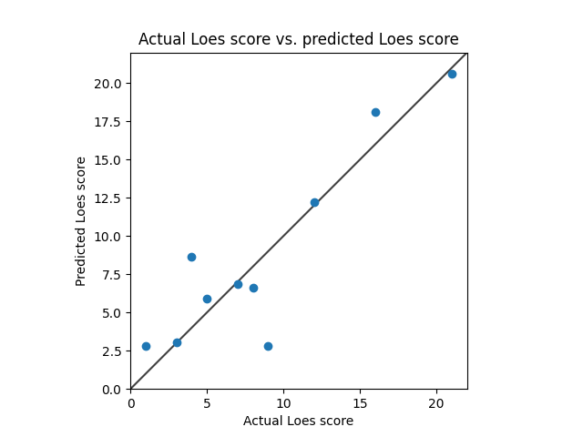

# Model 1
* data: all of Ashish's data
* Standardized RMSE: 1.206785682955434

* correlation:    0.8062695135102309
* p-value:        0.015638673839783852
* standard error: 0.11887297424632068
* SLURM script: *../src/dcan/training/loes-scoring-training_model01_mesabi.sh*
* Model: */home/feczk001/shared/data/AlexNet/LoesScoring/loes_scoring_02_512.pt*
* Epochs: 128
