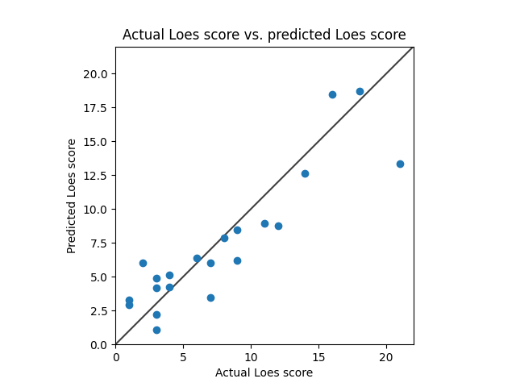
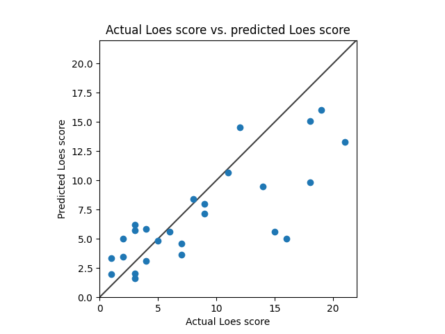

# Model 3
* Standardized RMSE: 0.5279896961137827

* correlation:    0.8928845104482298
* p-value:        5.214448809117684e-08
* standard error: 0.08727123644407582
* SLURM script: *../src/dcan/training/loes-scoring-training_model03_mesabi.sh*
* Model: */home/feczk001/shared/data/AlexNet/LoesScoring/loes_scoring_03_128.pt*
* Epochs: 128 (256 epochs overfits)
* batch-size: 5
* Files: Chosen irrespective of Gd enhancement
  * Igor's files: all (169 files)
  * Nascene's files: only those with QC of 1 (36 files)

# Model 4
* Standardized RMSE: 1.0055314462612834

* correlation:    0.7923266209658204
* p-value:        1.4078355863453417e-06
* standard error: 1.4078355863453417e-06
* SLURM script: *../src/dcan/training/loes-scoring-training_model04_mesabi.sh*
* Model: */home/feczk001/shared/data/AlexNet/LoesScoring/loes_scoring_04.pt*
* Epochs: 128
* batch-size: 5
* Files: Chosen irrespective of Gd enhancement
  * Igor's files: all (169 files)
  * Nascene's files: only those with QC of 1 or 2 (85 files)

# Model 1
* Standardized RMSE: 1.2942855794648784

* correlation:    0.8062695135102309
* p-value:        0.015638673839783852
* standard error: 0.11887297424632068
* SLURM script: *../src/dcan/training/loes-scoring-training_model01_mesabi.sh*
* Model: */home/feczk001/shared/data/AlexNet/LoesScoring/loes_scoring_02_512.pt*
* Epochs: 512
* File types: mprage.nii.gz

# Model 2
* Standardized RMSE: 0.8986175474134869

* correlation:    0.7734531513461287
* p-value:        0.024352772949611835
* standard error: 0.17330069759633573
* SLURM script: *../src/dcan/training/loes-scoring-training_model02_mesabi.sh*
* Model: */home/feczk001/shared/data/AlexNet/LoesScoring/loes_scoring_02.pt*
* File types: mprageGd.nii.gz

# Model 0
* Standardized RMSE: 1.4090845846066016

