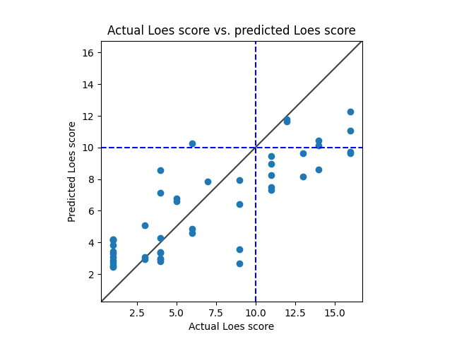

# Model 3
* data: all of Ashish's data
* Standardized RMSE: 0.8681073956588595

* correlation:    0.843721682323223
* p-value:        2.9023678644837652e-11
* standard error: 0.05826465079588512
* SLURM script: *../src/dcan/training/loes-scoring-training_model03_mesabi.sh*
* Model: */home/feczk001/shared/data/AlexNet/LoesScoring/loes_scoring_03.pt*
* Epochs: 512

# Model 2
* data: all of Ashish's data
* Standardized RMSE: 1.4974884284668133

* correlation:    0.861177276333397
* p-value:        6.596685767672446e-08
* standard error: 0.07132685112047961
* SLURM script: *../src/dcan/training/loes-scoring-training_model02_mesabi.sh*
* Model: */home/feczk001/shared/data/AlexNet/LoesScoring/loes_scoring_02.pt*
* Epochs: 256

# Model 1
* data: all of Ashish's data
* Standardized RMSE: 1.206785682955434

* correlation:    0.8062695135102309
* p-value:        6.18675208209489e-07
* standard error: 0.11887297424632068
* SLURM script: *../src/dcan/training/loes-scoring-training_model01_mesabi.sh*
* Model: */home/feczk001/shared/data/AlexNet/LoesScoring/loes_scoring_02_512.pt*
* Epochs: 128
