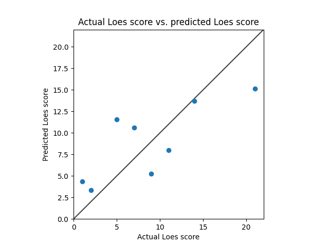
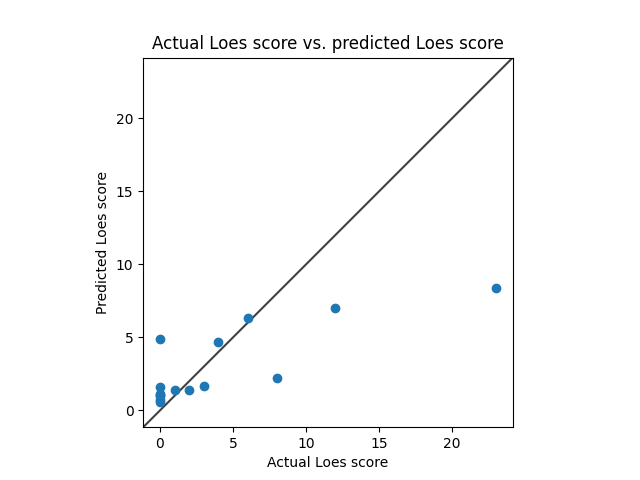

# Model 1
* Standardized RMSE: 1.2942855794648784

* correlation:    0.8062695135102309
* p-value:        0.015638673839783852
* standard error: 0.11887297424632068
* SLURM script: *../src/dcan/training/loes-scoring-training_model01_mesabi.sh*
* Model: */home/feczk001/shared/data/AlexNet/LoesScoring/loes_scoring_02_512.pt*
* Epochs: 512
* File types: mprage.nii.gz

# Model 2
* Standardized RMSE: 0.8986175474134869

* correlation:    0.7734531513461287
* p-value:        0.024352772949611835
* standard error: 0.17330069759633573
* SLURM script: *../src/dcan/training/loes-scoring-training_model02_mesabi.sh*
* Model: */home/feczk001/shared/data/AlexNet/LoesScoring/loes_scoring_02.pt*
* File types: mprageGd.nii.gz

# Model 0
* Standardized RMSE: 1.4090845846066016

