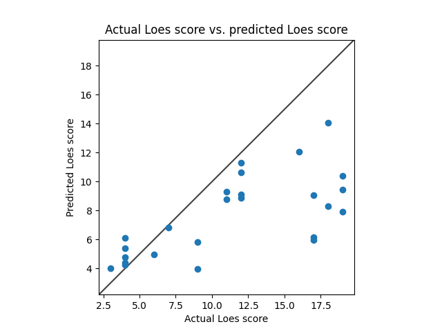
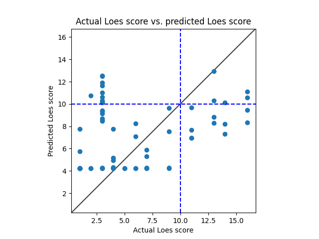

# Model 1
* data: all of Ashish's data
* Standardized RMSE: 0.7221896282431954

* correlation:    0.7137920287364632
* p-value:        1.233154773204162e-08
* standard error: 0.07224898056380212
* SLURM script: *../bin/loes-scoring-training_model01_mesabi.sh*
* Model: */home/feczk001/shared/data/AlexNet/LoesScoring/loes_scoring_02_512.pt*
* Epochs: 128
* lr: 0.0001

# Model 6
* data: all of Ashish's non-Gd data
* Standardized RMSE: 1.319839811464443

* correlation:    0.8416762616021709
* p-value:        4.819603892634009e-07
* standard error: 0.062030476568710614
* SLURM script: *../bin/loes-scoring-training_model06_mesabi.sh*
* Model: */home/feczk001/shared/data/AlexNet/LoesScoring/loes_scoring_06.pt*
* Epochs: 128
* lr: 0001

# Model 5
* data: all of Ashish's Gd-enhanced data
* Standardized RMSE: 1.3465736121901255

* correlation:    0.6639005760048992
* p-value:        0.0014129271260232773
* standard error: 0.09497052216668729
* SLURM script: *../bin/loes-scoring-training_model05_mesabi.sh*
* Model: */home/feczk001/shared/data/AlexNet/LoesScoring/loes_scoring_05.pt*
* Epochs: 512

# Model 4
* data: all of Ashish's data and Nascene's session data with QC of 1
  * 205 total cases
    * Ashish: 169
    * David: 36
* Standardized RMSE: 1.659556377232974

* correlation:    0.8326688004336145
* p-value:        2.172762045838301e-13
* standard error: 0.049556316542118485
* SLURM script: *../bin/loes-scoring-training_model04_mesabi.sh*
* Model: */home/feczk001/shared/data/AlexNet/LoesScoring/loes_scoring_04.pt*
* Epochs: 512
