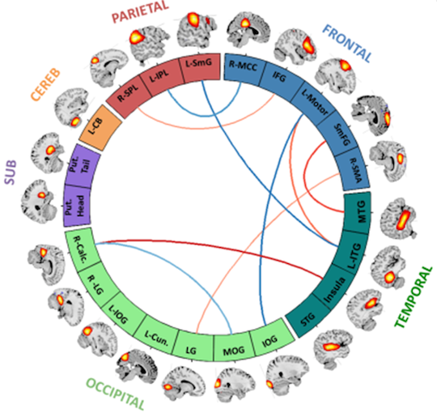
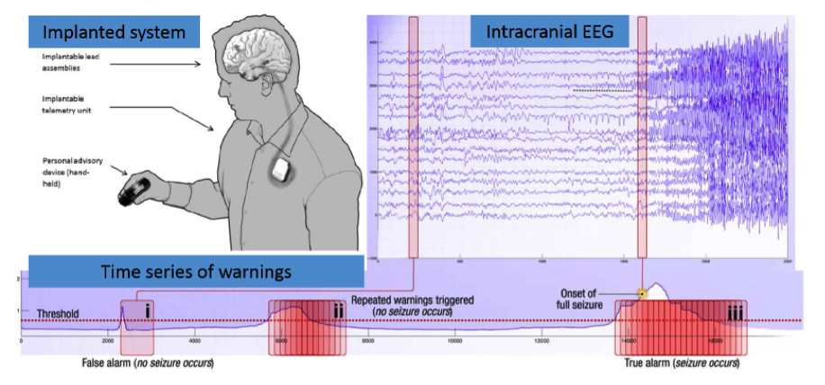

# Google Research Competitions Involving the Brain

Ideas from these competitions and the winning solutions could possibly be used in future MIDB projects.

1. [Parkinson's Freezing of Gait Prediction](https://www.kaggle.com/competitions/tlvmc-parkinsons-freezing-gait-prediction)
Event detection from wearable sensor data

The goal of this competition is to detect freezing of gait (FOG), a debilitating symptom that afflicts many people with Parkinsons disease. You will develop a machine learning model trained on data collected from a wearable 3D lower back sensor.

Your work will help researchers better understand when and why FOG episodes occur. This will improve the ability of medical professionals to optimally evaluate, monitor, and ultimately, prevent FOG events.

2. [TReNDS Neuroimaging](https://www.kaggle.com/competitions/trends-assessment-prediction)
Multiscanner normative age and assessments prediction with brain function, structure, and connectivity

In this competition, you will predict multiple assessments plus age from multimodal brain MRI features. You will be working from existing results from other data scientists, doing the important work of validating the utility of multimodal features in a normative population of unaffected subjects. Due to the complexity of the brain and differences between scanners, generalized approaches will be essential to effectively propel multimodal neuroimaging research forward.

The Tri-Institutional Georgia State University/Georgia Institute of Technology/Emory University Center for Translational Research in Neuroimaging and Data Science (TReNDS) leverages advanced brain imaging to promote research into brain health. The organization is focused on developing, applying and sharing advanced analytic approaches and neuroinformatics tools. Among its software projects are the GIFT and FIT neuroimaging toolboxes, the COINS data management system, and the COINSTAC toolkit for federated learning, all aimed at supporting data scientists and other neuroimaging researchers.

Making the leap from research to clinical application is particularly difficult in brain health. In order to translate to clinical settings, research findings have to be reproduced consistently and validated in out-of-sample instances. The problem is particularly well-suited for data science, but current approaches typically do not generalize well. With this large dataset and competition, your efforts could directly address an important area of brain research.

3. [American Epilepsy Society Seizure Prediction Challenge](https://www.kaggle.com/competitions/seizure-prediction)
   Predict seizures in intracranial EEG recordings

<b>Seizure forecasting systems hold promise for improving the quality of life for patients with epilepsy.</>

Epilepsy afflicts nearly 1% of the world's population, and is characterized by the occurrence of spontaneous seizures. For many patients, anticonvulsant medications can be given at sufficiently high doses to prevent seizures, but patients frequently suffer side effects. For 20-40% of patients with epilepsy, medications are not effective -- and even after surgical removal of epilepsy-causing brain tissue, many patients continue to experience spontaneous seizures. Despite the fact that seizures occur infrequently, patients with epilepsy experience persistent anxiety due to the possibility of a seizure occurring.

Seizure forecasting systems have the potential to help patients with epilepsy lead more normal lives. In order for EEG-based seizure forecasting systems to work effectively, computational algorithms must reliably identify periods of increased probability of seizure occurrence. If these seizure-permissive brain states can be identified, devices designed to warn patients of impeding seizures would be possible. Patients could avoid potentially dangerous activities like driving or swimming, and medications could be administered only when needed to prevent impending seizures, reducing overall side effects.

There is emerging evidence that the temporal dynamics of brain activity can be classified into 4 states: Interictal (between seizures, or baseline), Preictal (prior to seizure), Ictal (seizure), and Post-ictal (after seizures). Seizure forecasting requires the ability to reliably identify a preictal state that can be differentiated from the interictal, ictal, and postictal state. The primary challenge in seizure forecasting is differentiating between the preictal and interictal states. The goal of the competition is to demonstrate the existence and accurate classification of the preictal brain state in dogs and humans with naturally occurring epilepsy.

4. [MLSP 2014 Schizophrenia Classification Challenge](https://www.kaggle.com/competitions/mlsp-2014-mri)
   Diagnose schizophrenia using multimodal features from MRI scans)

Schizophrenia is a severe and disabling mental illnesses which has no well-established, non-invasive diagnosis biomarker. Currently, due to its symptom overlap with other mental illnesses (like bipolar disorder) it can only be diagnosed subjectively, by process of elimination.

This competition invites you to automatically diagnose subjects with schizophrenia based on multimodal features derived from their brain magnetic resonance imaging (MRI) scans.

The features made available in this competition are a result from current state-of-the art developments in neuroimaging and MRI data processing. Two modalities of MRI scans are used to obtain these features: functional and structural MRI. One challenge in this competition is how to optimally combine this type of multimodal information and select features that enhance diagnosis. Optional additional information is provided that could be helpful with this particular aspect of the task.

5. [Melbourne University AES/MathWorks/NIH Seizure Prediction](https://www.kaggle.com/competitions/melbourne-university-seizure-prediction)
   Predict seizures in long-term human intracranial EEG recordings

Epilepsy afflicts nearly 1% of the world's population, and is characterized by the occurrence of spontaneous seizures. For many patients, anticonvulsant medications can be given at sufficiently high doses to prevent seizures, but patients frequently suffer side effects. For 20-40% of patients with epilepsy, medications are not effective. Even after surgical removal of epilepsy, many patients continue to experience spontaneous seizures. Despite the fact that seizures occur infrequently, patients with epilepsy experience persistent anxiety due to the possibility of a seizure occurring.

Seizure forecasting systems have the potential to help patients with epilepsy lead more normal lives. In order for electrical brain activity (EEG) based seizure forecasting systems to work effectively, computational algorithms must reliably identify periods of increased probability of seizure occurrence. If these seizure-permissive brain states can be identified, devices designed to warn patients of impeding seizures would be possible. Patients could avoid potentially dangerous activities like driving or swimming, and medications could be administered only when needed to prevent impending seizures, reducing overall side effects.

