# Fairview-AG data
## (Partial) training set

Only one run per session.

### Subject 01
#### Session 01
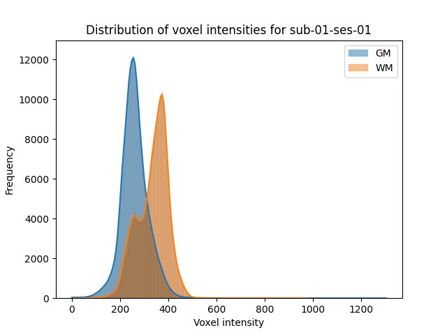
#### Session 02
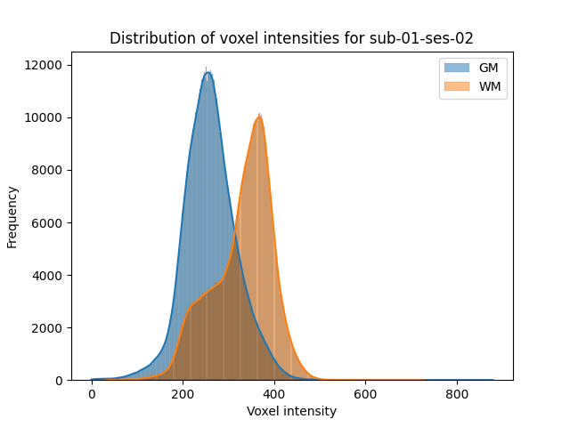
#### Session 03
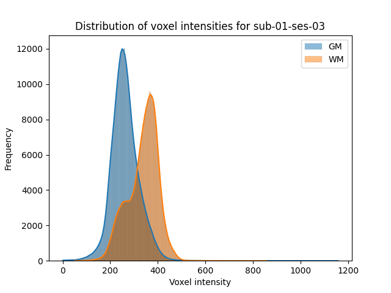 
#### Session 04
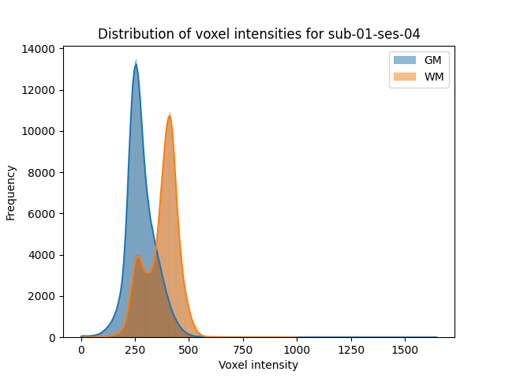 
### Subject 02
#### Session 01
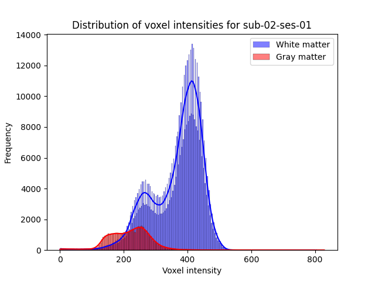  
#### Session 02
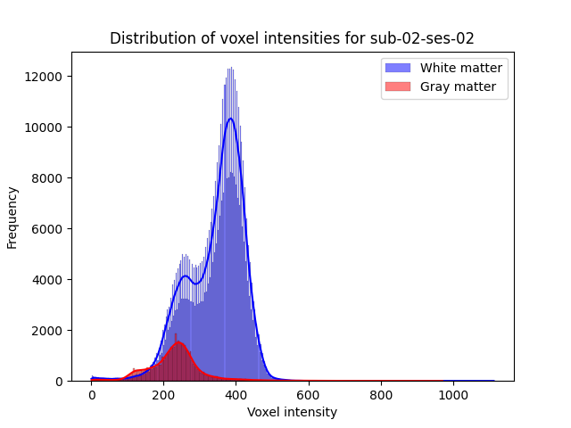  
#### Session 03
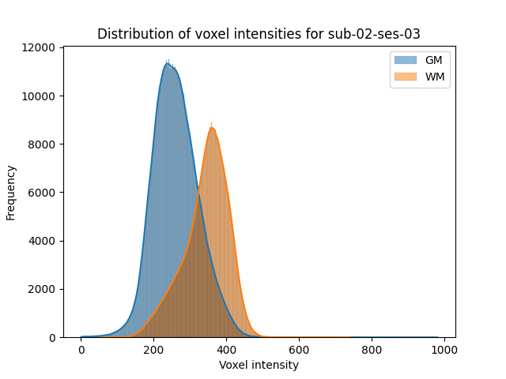  
#### Session 04
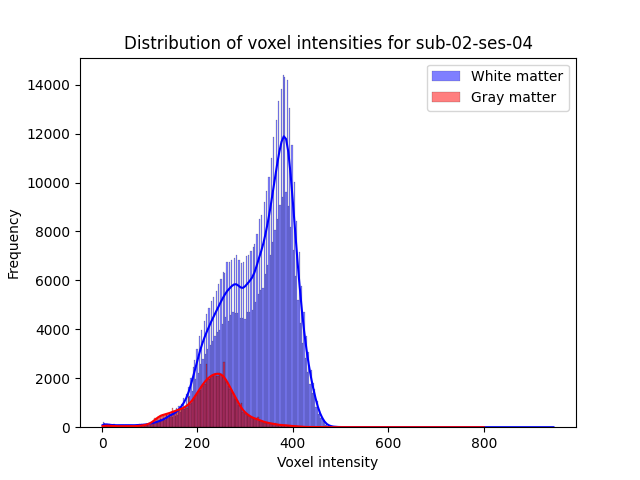  
#### Session 05
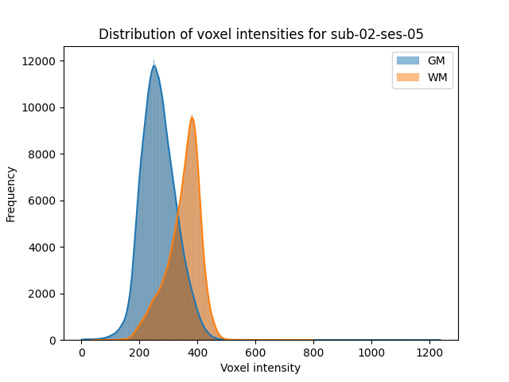  
### Subject 03
#### Session 01
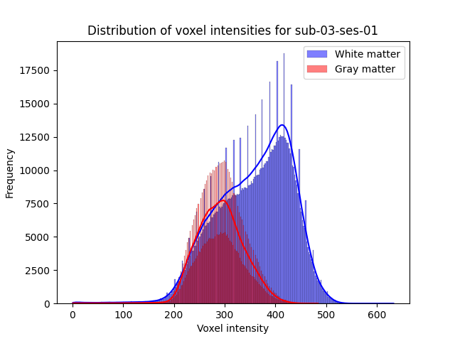  
#### Session 02
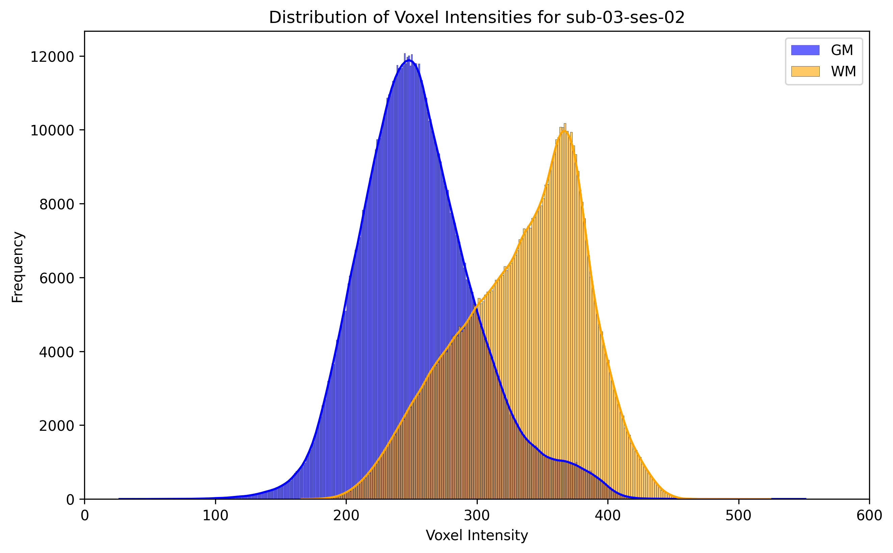  
#### Session 03
  
#### Session 04
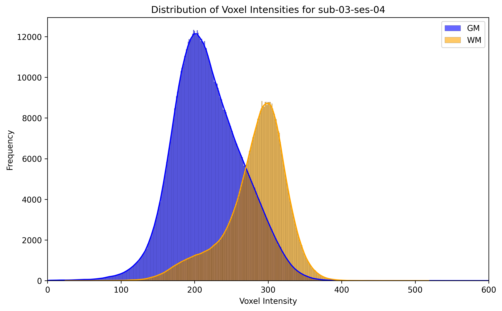
### Subject 04
#### Session 01

#### Session 02
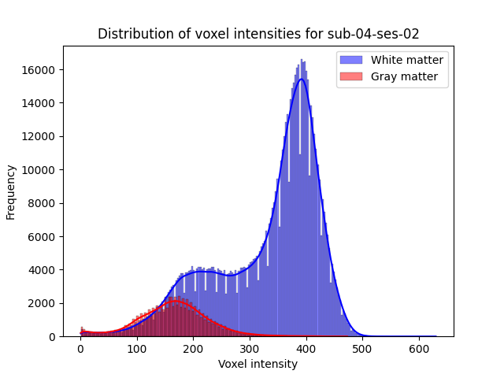
### Subject 05
#### Session 01
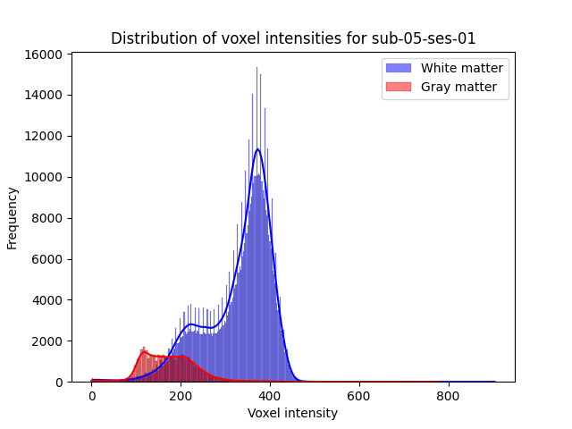
#### Session 02
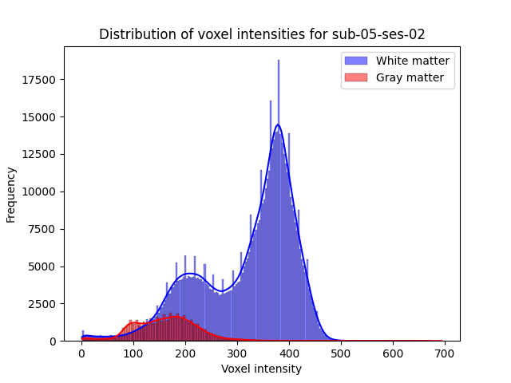
#### Session 03
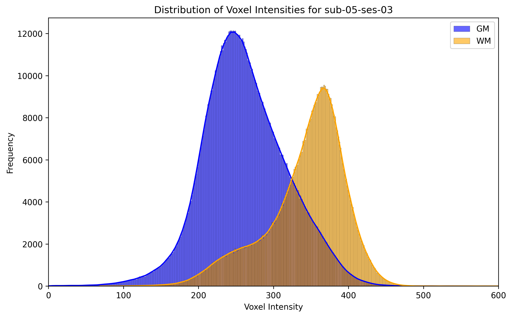