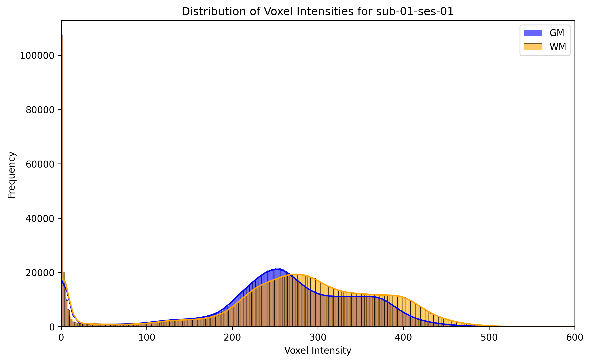
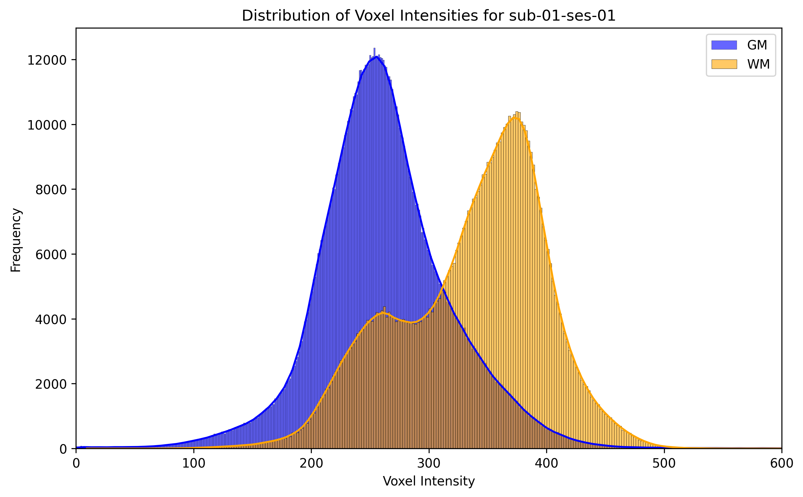
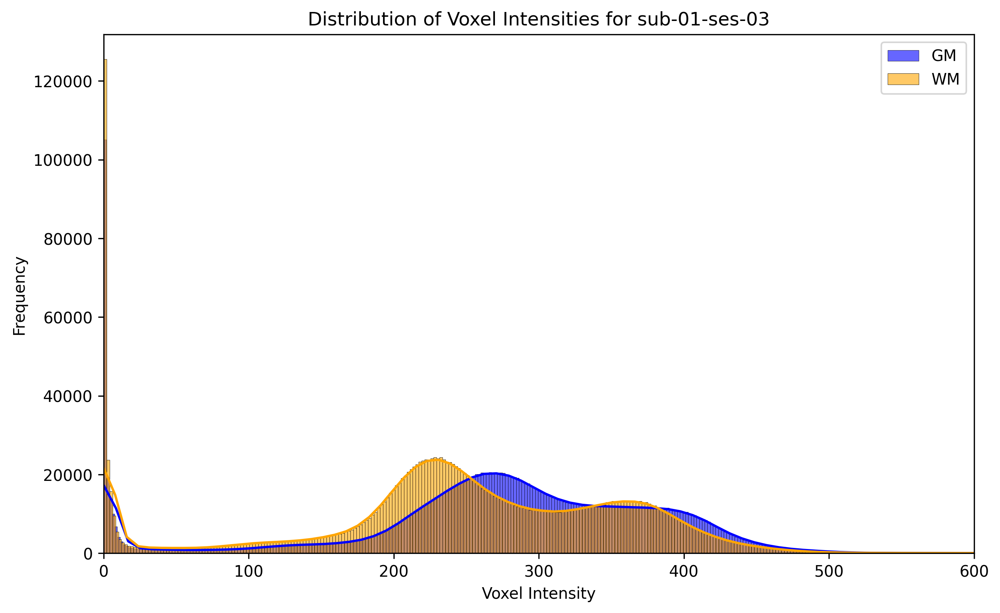
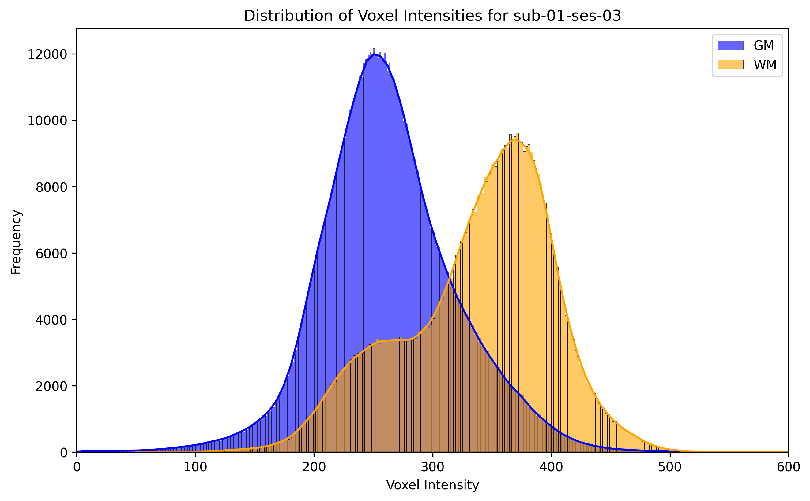
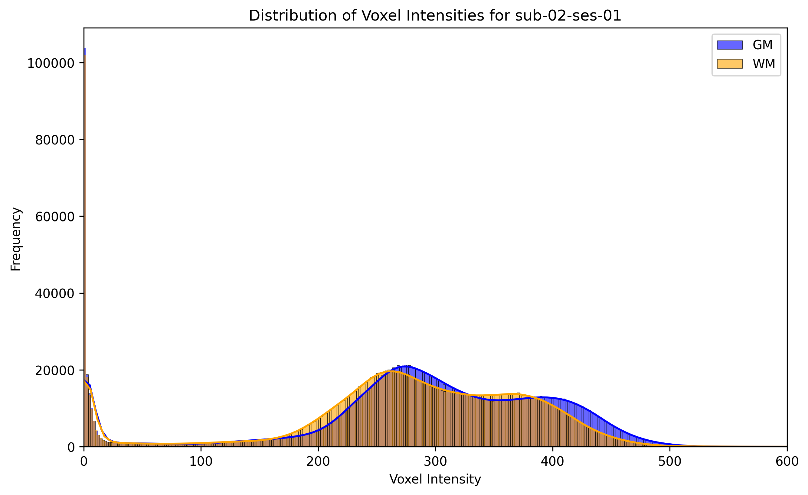
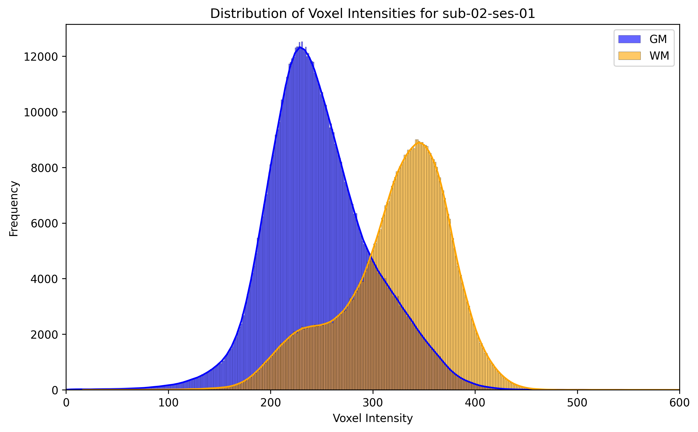
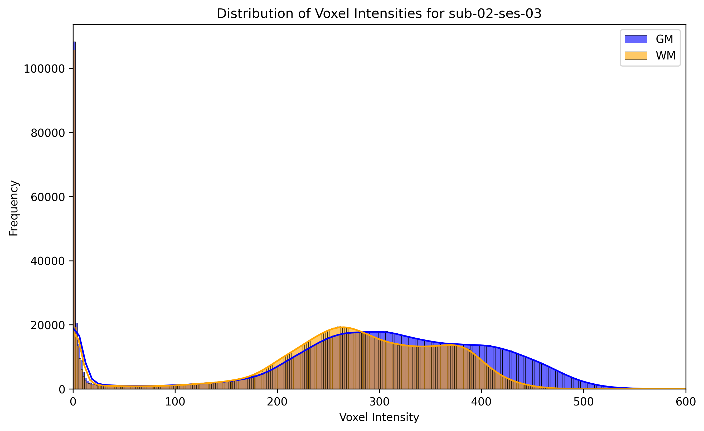
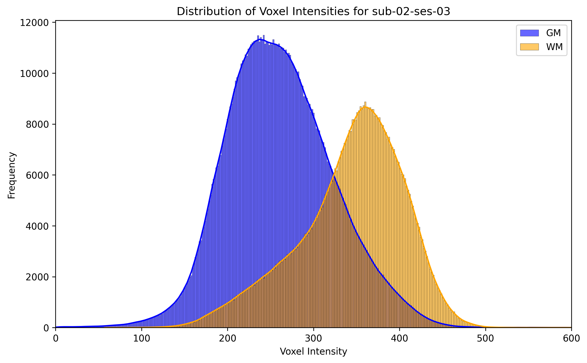
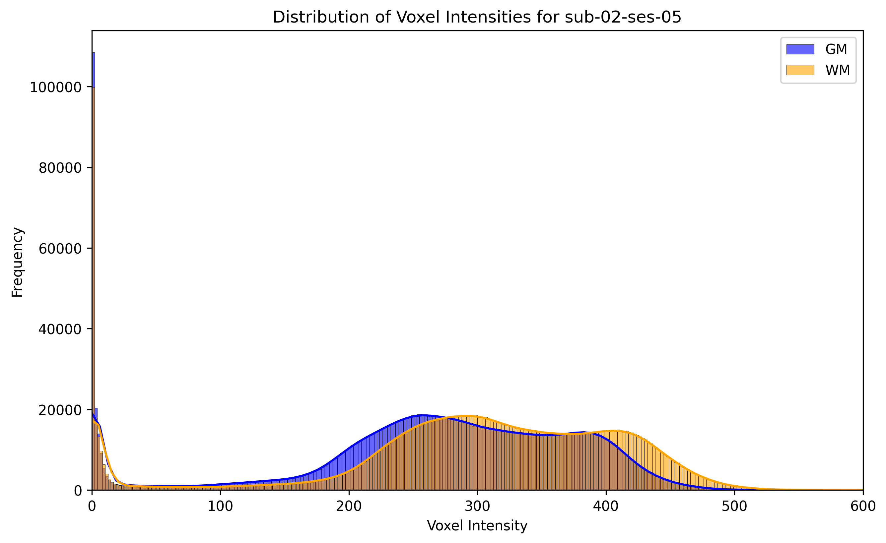
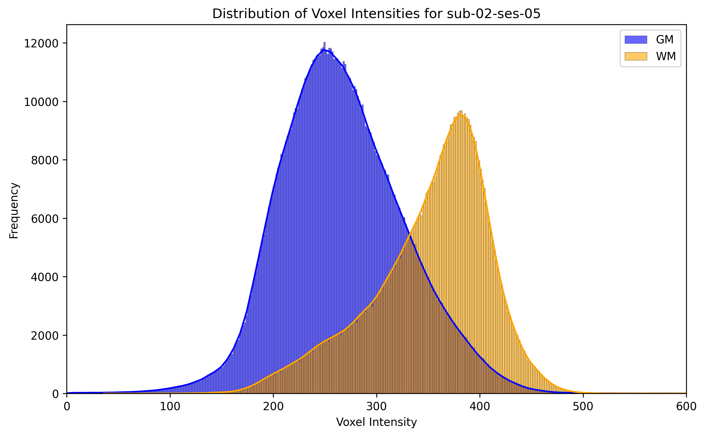

# Fairview-AG data
## (Partial) training set

Only one run per session.

### Subject 01
#### Session 01
##### Before RAVEL

##### After RAVEL

#### Session 03
##### Before RAVEL

##### After RAVEL
 
### Subject 02
#### Session 01
##### Before RAVEL

##### After RAVEL
  
#### Session 03
##### Before RAVEL

##### After RAVEL
  
#### Session 05
##### Before RAVEL

##### After RAVEL
  
