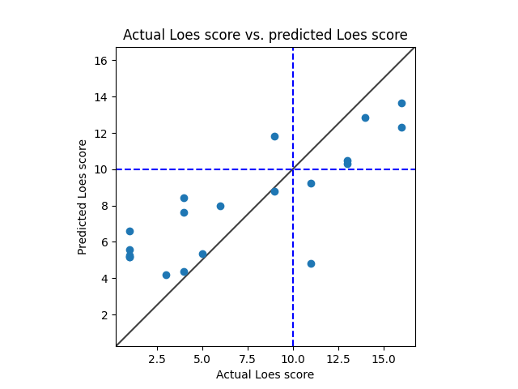

# Model 7
* data: /home/miran045/reine097/projects/loes-scoring-2/data/filtered/ashish_all.csv
* Gd: Only enhanced scans.
* Standardized RMSE: 1.0938171192956212

* correlation:    0.7576594621674633
* p-value:        7.596305667726401e-06
* standard error: 0.07602646225786082
* SLURM script: ../../bin/loes-scoring-training_model07_mesabi.sh*
* Model: */home/feczk001/shared/data/AlexNet/LoesScoring/loes_scoring_07.pt*
* Epochs: 128
* lr: 0.0001
* output_csv: /home/miran045/reine097/projects/loes-scoring-2/data/filtered/model07_out.csv
