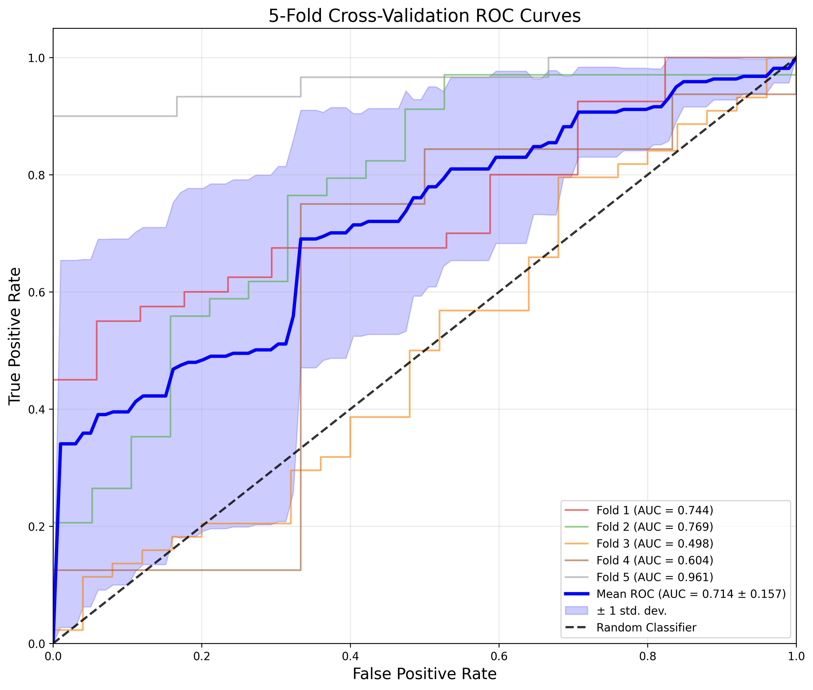

# Model 00

* data: */users/9/reine097/projects/loes-scoring-2/data/logistic_regression_data.csv*

* SLURM script: [*create_early_detection_model_00.sh*](../../../../scripts/training/logistic-regression/create_early_detection_model_00.sh)

---

### CROSS-VALIDATION RESULTS WITH ROC ANALYSIS
* Accuracy: 0.3686 +- 0.1885
* Precision: 0.7192 +- 0.3600
* Ppv: 0.7192 +- 0.3600
* Recall: 0.2033 +- 0.1155
* F1: 0.3144 +- 0.1706
* Auc: 0.4845 +- 0.2564
* Sensitivity: 0.2033 +- 0.1155
* Specificity: 0.7468 +- 0.3737
* Pauc: 0.1369 +- 0.0910

### ROC CURVE STATISTICS:
* AUC per fold: ['0.5000', '0.5000', '0.5000', '0.5000', '0.5000']
* Mean AUC: 0.5000 +- 0.0000
* Min AUC: 0.5000
* Max AUC: 0.5000
