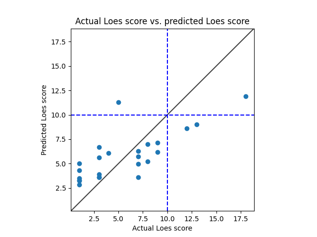

# Model 8
* data: /home/miran045/reine097/projects/loes-scoring-2/data/filtered/ashish_all.csv
* Gd: Only un-enhanced scans.
* Standardized RMSE: 1.2190641793027288

* correlation:    0.75438282822274
* p-value:        2.0586716154741885e-05
* standard error: 0.07728599651907234
* SLURM script: ../../bin/loes-scoring-training_model08_mesabi.sh*
* Model: */home/feczk001/shared/data/AlexNet/LoesScoring/loes_scoring_08.pt*
* Epochs: 128
* lr: 0.0001
* output_csv: /home/miran045/reine097/projects/loes-scoring-2/doc/models/model08/output.csv
