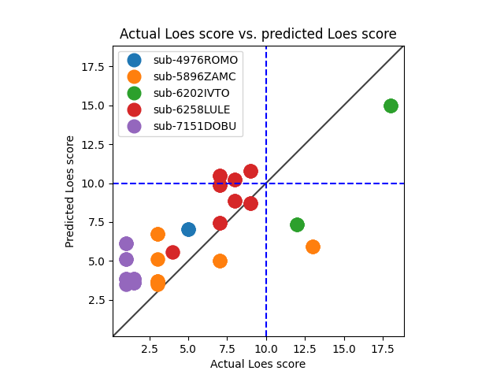

# Model 9
## Five-fold cross-validation
* data: /home/miran045/reine097/projects/loes-scoring-2/data/filtered/ashish_all.csv
* Gd: Both enhanced and unenhanced scans.
* standardized_rmse: 1.427018951375629

* correlation:    0.5501755781535607
* p-value:        9.323839675687397e-15
* standard error: 0.038831366436713984
* SLURM script: ../../../bin/loes-scoring-training_model09_mesabi.sh*
* Epochs: 256
* lr: 0.0001
* output_csv: /home/miran045/reine097/projects/loes-scoring-2/doc/models/five_fold_validation/output_all.csv
