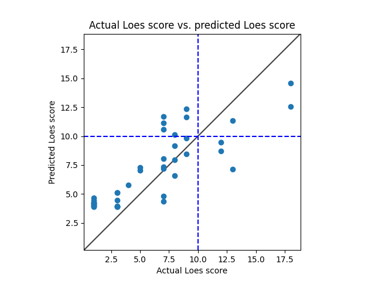

# Model 9
* data: /home/miran045/reine097/projects/loes-scoring-2/data/filtered/ashish_all.csv
* Gd: Both enhanced and unenhanced scans.
* Standardized RMSE: 0.8979252507663843

* correlation:    0.8374484290169241
* p-value:        2.555448904468882e-12
* standard error: 0.057910642181159024
* SLURM script: ../../../bin/loes-scoring-training_model09_mesabi.sh*
* Model: */home/feczk001/shared/data/AlexNet/LoesScoring/loes_scoring_09_256.pt*
* Epochs: 512
* lr: 0.0001
* output_csv: /home/miran045/reine097/projects/loes-scoring-2/doc/models/model09/output_256.csv
