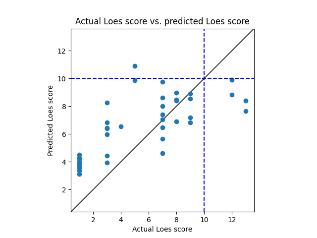

# Model 11
* data: /home/miran045/reine097/projects/loes-scoring-2/data/filtered/ashish_all_low_loes_scores.csv
* Gd: Both enhanced and unenhanced scans.
* Standardized RMSE: 1.2719902763223678

* correlation:    0.7339622568252901
* p-value:        4.75287638500951e-08
* standard error: 0.06448283939686567
* SLURM script: ../../../bin/loes-scoring-training_model11_mesabi.sh*
* Model: */home/feczk001/shared/data/AlexNet/LoesScoring/loes_scoring_09_256.pt*
* Epochs: 512
* lr: 0.0001
* output_csv: /home/miran045/reine097/projects/loes-scoring-2/doc/models/model09/output_256.csv
