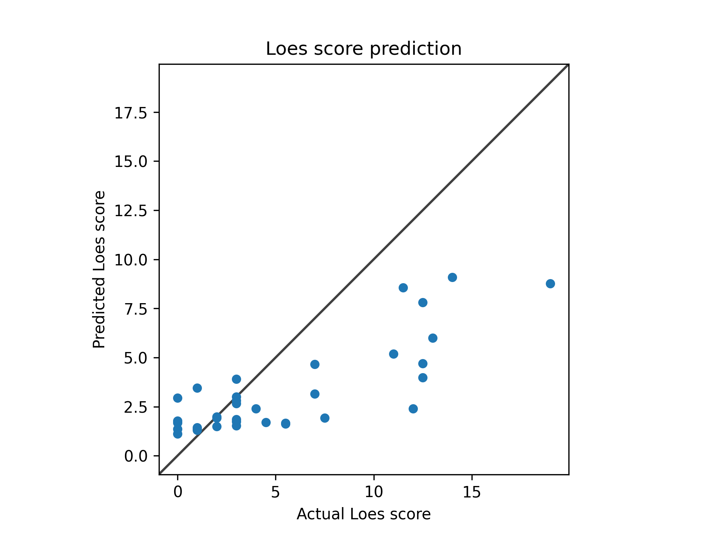

# Model 12
* data: /users/9/reine097/projects/loes-scoring-2/data/anon_train_scans_and_loes.csv
* Gd: Unenhanced scans.
* Standardized RMSE: 0.8022011222885228

* correlation:    0.8139580489078295
* SLURM script: *bin/training/loes-scoring-training_model_agate_12.sh*
* Model: */home/feczk001/shared/data/AlexNet/LoesScoring/loes_scoring_12.pt*
* Epochs: 512
* lr: 0.001
* output_csv: doc/models/model12/model12.csv
