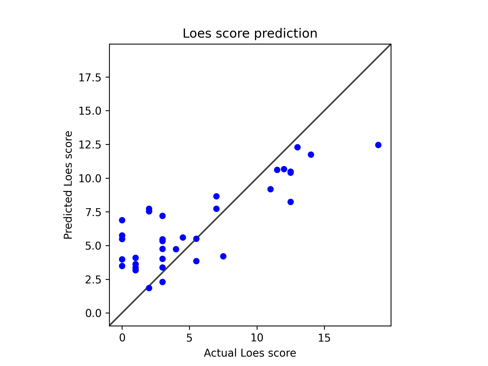

# Model 14
## 256 epochs

Use a weighted loss function.

* Model type: ResNet
* data: */users/9/reine097/projects/loes-scoring-2/data/anon_train_scans_and_loes.csv*
* Gd: Unenhanced scans.
* Standardized RMSE: 0.5493011060356481

* correlation:    0.8722199648605399
* SLURM script: [*loes-scoring-training_model_agate_14.sh*](../../../bin/training/loes-scoring-training_model_agate_14.sh)
* Epochs: 256
* lr: 0.0001
* output_csv: [*model14.csv*](model14.csv)
* model: */home/feczk001/shared/data/AlexNet/LoesScoring/loes_scoring_14_512.pt*
* Pearson correlation p-value: 8.82007615494348e-12
* Spearman correlation p-value: 2.071065134912695e-06
