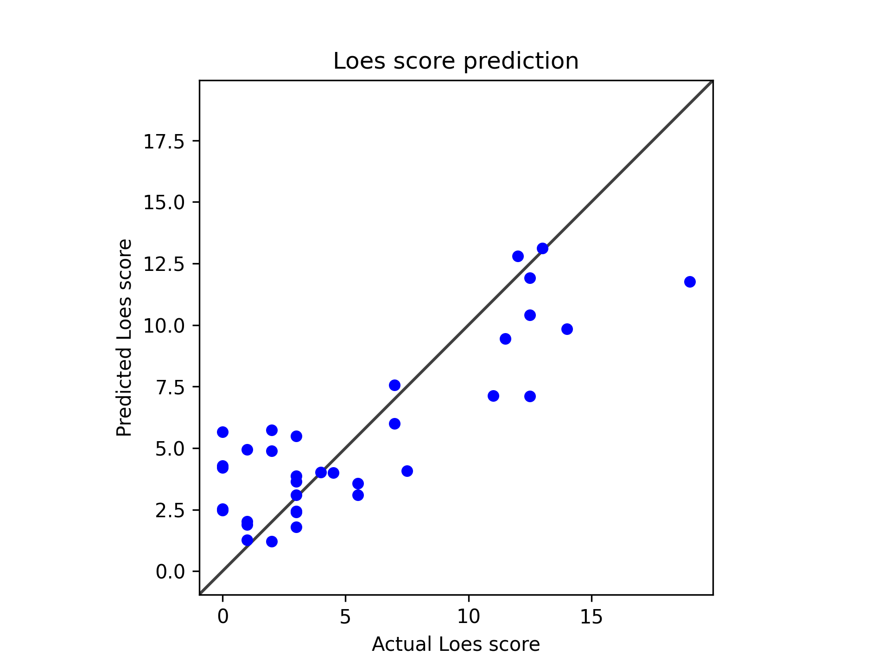

# Model 17

Added another layer to ResNet

            model = \
                Regressor(
                    in_shape=[1, 197, 233, 189], 
                    out_shape=1, 
                    channels=(16, 32, 64, 128, 256, 512, 1024), 
                    strides=(2, 2, 2, 2))
---
* Model type: ResNet
* data: */users/9/reine097/projects/loes-scoring-2/data/anon_train_scans_and_loes.csv*
* Gd: Unenhanced scans.
* Standardized RMSE: 0.5491358693925369

* correlation:    0.8486751816313611
* SLURM script: [*loes-scoring-training_model_agate_17.sh*](../../../bin/training/loes-scoring-training_model_agate_17.sh)
* Epochs: 256
* lr: 0.0001
* output_csv: [*model17.csv*](model17.csv)
* model: */home/feczk001/shared/data/AlexNet/LoesScoring/loes_scoring_17.pt*
* Pearson correlation p-value: 1.1958302729934778e-10
* Spearman correlation p-value: 1.7842772622414715e-05
