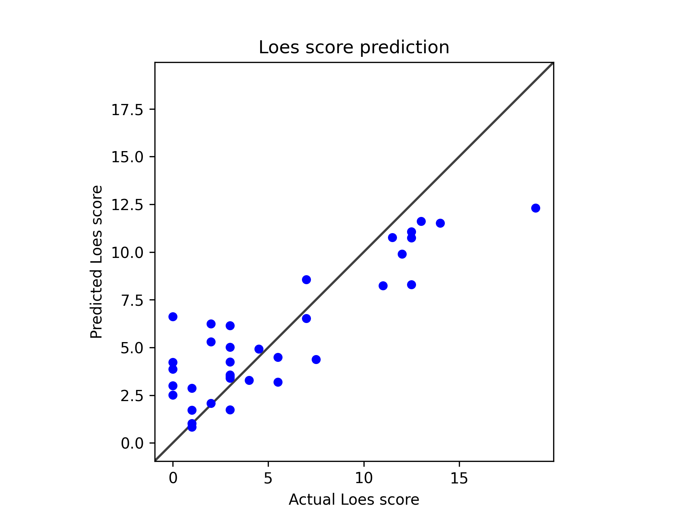

# Model 18

Used step scheduler.

            scheduler = StepLR(self.optimizer, step_size=30, gamma=0.1)
---
* Model type: ResNet
* Scheduler: StepLR
* data: */users/9/reine097/projects/loes-scoring-2/data/anon_train_scans_and_loes.csv*
* Gd: Unenhanced scans.
* Standardized RMSE: 0.522702804739522

* correlation:    0.8758708441134037
* SLURM script: [*loes-scoring-training_model_agate_18.sh*](../../../bin/training/loes-scoring-training_model_agate_18.sh)
* Epochs: 256
* lr: 0.0001
* output_csv: [*model18.csv*](model18.csv)
* model: */home/feczk001/shared/data/LoesScoring/loes_scoring_18.pt*
* Pearson correlation p-value: 5.6237612067592795e-12
* Spearman correlation p-value: 3.433123742765212e-07
