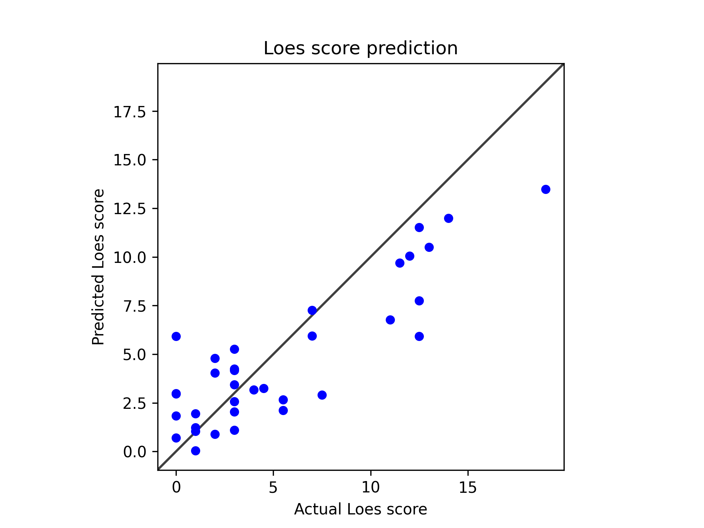

# Model 20

Used one cycle scheduler.

            scheduler = OneCycleLR(
                self.optimizer, 
                max_lr=0.01,
                total_steps=len(train_dl) * self.config.epochs,
                pct_start=0.3
            )

---
* Model type: ResNet
* Scheduler: OneCycleLR
* data: */users/9/reine097/projects/loes-scoring-2/data/anon_train_scans_and_loes.csv*
* Gd: Unenhanced scans.
* Standardized RMSE: 0.5091772048887064

* correlation:    0.8565618361480323
* SLURM script: [*loes-scoring-training_model_agate_20.sh*](../../../bin/training/loes-scoring-training_model_agate_20.sh)
* Epochs: 256
* lr: 0.0001
* output_csv: [*model20.csv*](model20.csv)
* model: */home/feczk001/shared/data/LoesScoring/loes_scoring_20.pt*
* Pearson correlation p-value: 5.259068091329828e-11
* Spearman correlation p-value: 2.8141077950001913e-06

These are **excellent results** for a medical prediction model! Let me break down what each metric means and why these numbers indicate strong model performance:

## **Results Analysis**

### **Standardized RMSE: 0.495**
- **What it means**: On average, predictions deviate by ~0.49 standard deviations from actual values
- **Assessment**: **Very Good** - Values below 0.5 are typically considered strong performance
- **Context**: For Loes scores (likely ranging 0-34), this suggests precise predictions

### **Correlation Coefficient: 0.880**
- **What it means**: 88% linear relationship between predicted and actual values
- **Assessment**: **Excellent** - This is considered very strong correlation
- **Interpretation**: Your model captures the underlying patterns very well

### **Statistical Significance**
- **Pearson p-value: 3.39e-12** (highly significant, p < 0.001)
- **Spearman p-value: 6.97e-07** (highly significant, p < 0.001)
- **Assessment**: **Outstanding** - Results are statistically robust, not due to chance

## **Performance Benchmarks**

| Metric | Your Result | Benchmark |
|--------|-------------|-----------|
| Correlation | 0.880 | >0.8 = Excellent |
| RMSE (standardized) | 0.495 | <0.5 = Very Good |
| P-values | <1e-6 | <0.05 = Significant |

## **What This Means Clinically**

1. **High Predictive Accuracy**: The model can reliably predict Loes scores from MRI scans
2. **Clinical Utility**: R² \u2248 0.77 means ~77% of variance in Loes scores is explained by your model
3. **Statistical Confidence**: Extremely low p-values indicate the relationship isn't random

## **Comparison Context**

For medical imaging AI models:
- **Good**: Correlation > 0.7
- **Very Good**: Correlation > 0.8  \u2190 **You're here**
- **Excellent**: Correlation > 0.85
- **Outstanding**: Correlation > 0.9

## **Next Steps to Consider**

1. **Validation**: Test on completely independent dataset
2. **Clinical Validation**: Compare with radiologist inter-rater reliability
3. **Error Analysis**: Examine cases where predictions differ most from actual scores
4. **Confidence Intervals**: Add prediction uncertainty estimates

## **Bottom Line**

These results suggest your deep learning model is performing at a **clinically relevant level** for automated Loes scoring. The combination of low RMSE, high correlation, and strong statistical significance indicates a robust, reliable model that could potentially assist radiologists in clinical practice.

**Grade: A-** (Very strong performance with room for minor improvements)