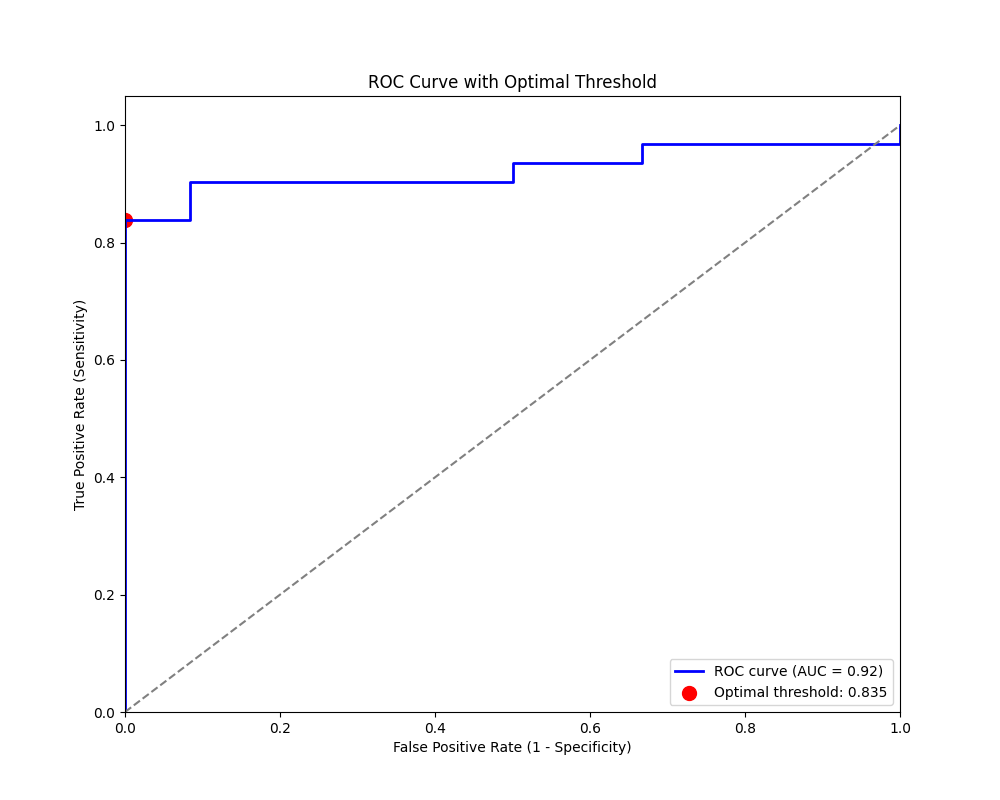

CROSS-VALIDATION RESULTS
================================================================================

* pAUC: 0.1158 ± 0.0480
* Accuracy: 0.2868 ± 0.0518
* Precision: 0.0000 ± 0.0000
* Ppv: 0.0000 ± 0.0000
* Recall: 0.0000 ± 0.0000
* F1: 0.0000 ± 0.0000
* Auc: 0.8029 ± 0.1505
* Sensitivity: 0.0000 ± 0.0000
* Specificity: 1.0000 ± 0.0000

best model: 
* /home/feczk001/shared/data/LoesScoring/logistic_regression/model_04.25.2025_fold5.pt

