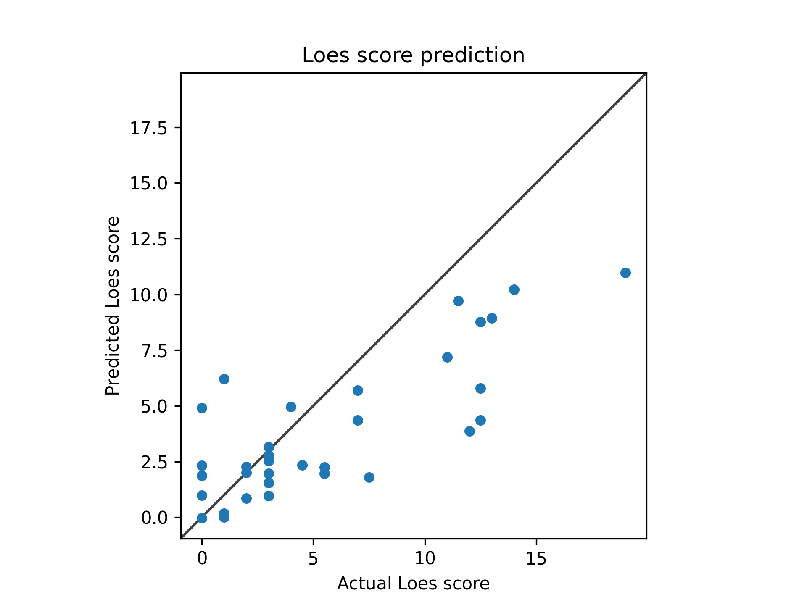

# Model 12
## 512 epochs
* data: */users/9/reine097/projects/loes-scoring-2/data/anon_train_scans_and_loes.csv*
* Gd: Unenhanced scans.
* Standardized RMSE: 0.6982109526265023

* correlation:    0.8139580489078295
* SLURM script: [*loes-scoring-training_model_agate_12.sh*](../../../../bin/training/loes-scoring-training_model_agate_12_512.sh)
* Epochs: 512
* lr: 0.001
* output_csv: [*model12_512.csv*](../512_epochs/model12_512.csv)
* model: */home/feczk001/shared/data/AlexNet/LoesScoring/loes_scoring_12_512.pt*
