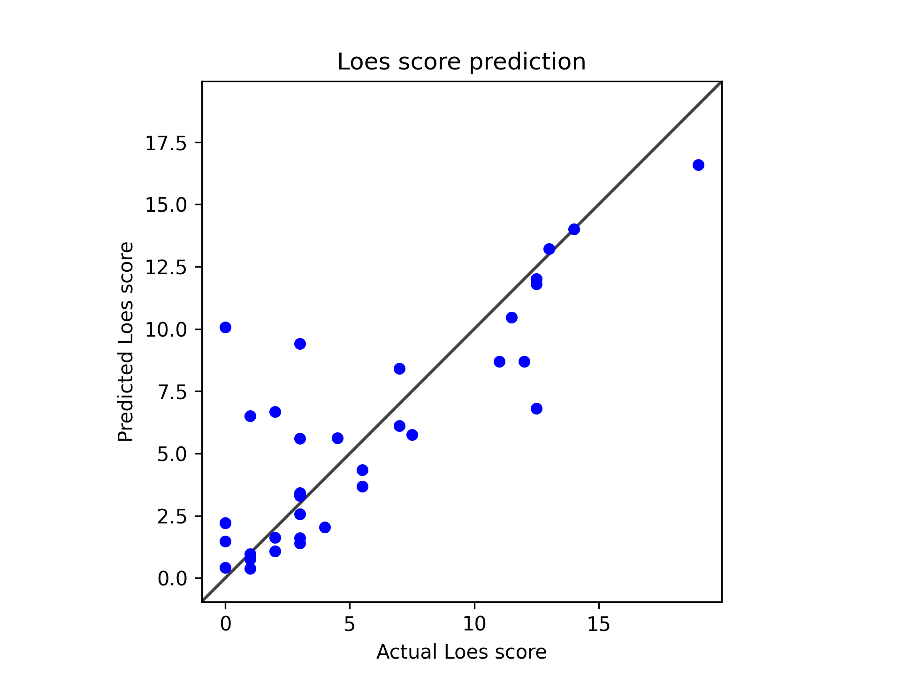

# Model 15

* Model type: ResNet
* Epochs: 256
* data: */users/9/reine097/projects/loes-scoring-2/data/anon_train_scans_and_loes.csv*
* Gd: Unenhanced scans.
* Standardized RMSE: 0.564280574055299

* correlation:    0.8227921505229698
* SLURM script: [*loes-scoring-training_model_agate_14.sh*](../../../bin/training/loes-scoring-training_model_agate_15.sh)
* Epochs: 256
* lr: 0.0001
* output_csv: [*model15.csv*](model15.csv)
* model: */home/feczk001/shared/data/AlexNet/LoesScoring/loes_scoring_14_512.pt*
* Pearson correlation p-value: 1.3197536844215122e-09
* Spearman correlation p-value: 6.769169521483917e-07
