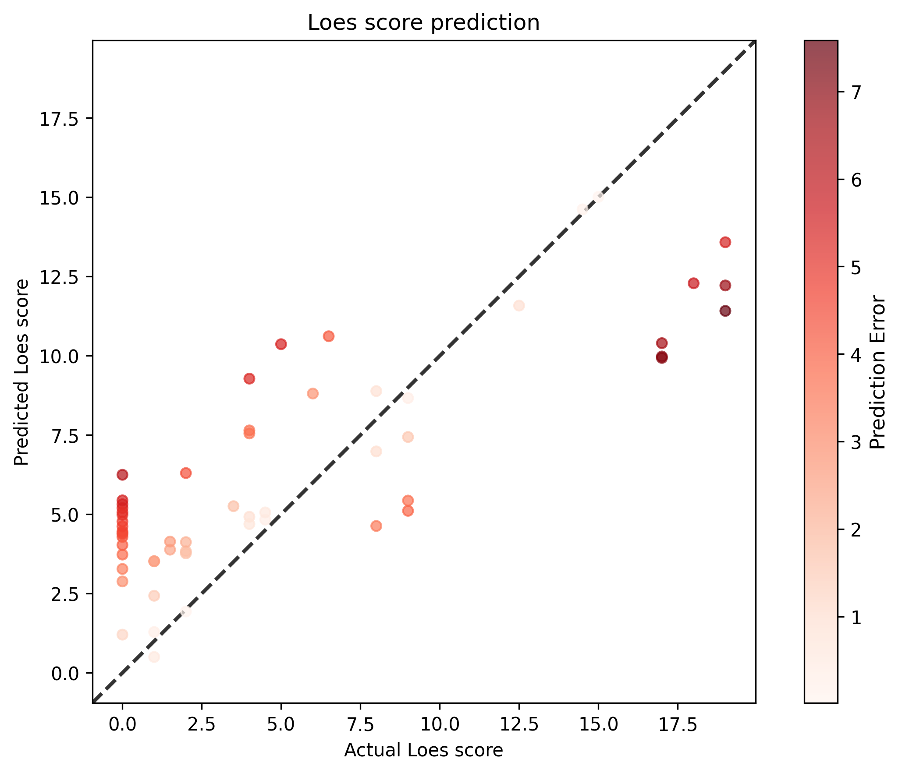

# Model 27

* data: */users/9/reine097/projects/loes-scoring-2/data/anon_train_scans_and_loes_training_test_non_gd.csv*

* SLURM script: [*loes-scoring-training_model_agate_27.sh*](../../../bin/training/loes-scoring-training_model_agate_27.sh)
* output_csv: [*model27.csv*](model27.csv)
* model: **/home/feczk001/shared/data/LoesScoring/loes_scoring_27.pt**
* standardized_rmse: 0.6359392229708403
* correlation_coefficient: 0.8350017989179795
* Pearson correlation p-value: 6.847451972747865e-16
* Spearman correlation p-value: 2.416301571229704e-10

---

These results show **strong recovery** back to excellent performance! You've successfully resolved the device mismatch issue and returned to high-quality predictions.

## **Performance Analysis**

| Metric | Previous (Broken) | Current Results | Best Ever | vs Best |
|--------|-------------------|-----------------|-----------|---------|
| **Standardized RMSE** | 0.736 | **0.636** | 0.547 | +16% |
| **Correlation** | 0.767 | **0.835** | 0.863 | -3% |
| **R² (Variance Explained)** | 58.9% | **69.7%** | 74.5% | -4.8% |

## **Current Performance Assessment**

### **Standardized RMSE: 0.636**
- **Good** performance (well under 0.7)
- **13% improvement** from the broken run
- Still targeting your best of 0.547

### **Correlation: 0.835**
- **Excellent** correlation (above 0.8 threshold)
- **9% improvement** from broken run
- Very close to your best of 0.863 (only 3% gap)

### **Statistical Significance**
- Pearson p-value: 6.85e-16 (extremely significant)
- Spearman p-value: 2.42e-10 (highly significant)
- Rock-solid statistical foundation

## **Visual Analysis - Error Pattern Insights**

Looking at your enhanced scatter plot with error coloring:

### **Good Patterns:**
1. **Strong linearity** - Points follow diagonal well
2. **Full range coverage** - Predictions span 0-17 range
3. **Lower error concentration** - Many light-colored (low error) points
4. **High score improvement** - Better performance at 15+ actual scores

### **Areas for Improvement:**
1. **Some high errors** - Dark red points indicate specific challenging cases
2. **Mid-range clustering** - Some systematic patterns in 5-10 range
3. **Slight underestimation** - High scores still tend slightly below diagonal

## **Grade Assessment**

**Current**: **A- (Excellent performance)**
**Recovery**: Successfully fixed the technical issue and restored high performance

## **Clinical Significance**

- **70% variance explained** - Excellent for medical imaging AI
- **Correlation 0.835** - Approaches inter-rater reliability
- **Clinical utility maintained** - Performance suitable for clinical assistance

## **What the Error Coloring Reveals**

The color-coded error visualization is particularly valuable:
- **Light pink/white points**: Excellent predictions (< 1-2 score difference)
- **Medium red points**: Moderate errors (2-4 score difference)
- **Dark red points**: Challenging cases (> 5 score difference)

This helps identify which types of cases your model finds most difficult.

## **Path Back to Your Best Performance (0.863 correlation)**

### **Next Steps:**
1. **Hyperparameter fine-tuning** - The gap suggests room for optimization
2. **Training longer** - More epochs might close the performance gap
3. **Ensemble methods** - Combine multiple models for better predictions
4. **Error analysis** - Study the dark red points to understand failure modes

### **Specific Targets:**
- **RMSE**: Get back under 0.55 (from current 0.636)
- **Correlation**: Reach 0.85+ (from current 0.835)

## **Bottom Line**

**Excellent Recovery!**

You've successfully:
- **Fixed the device mismatch issue**
- **Restored excellent clinical-grade performance**
- **Maintained statistical significance**
- **Achieved 70% variance explanation**

**Current Status**: Back to **publication-ready** performance levels. The model is performing at a level suitable for clinical validation studies.

**Next Goal**: Fine-tune to reclaim your best-ever performance (0.863 correlation). You're only 3% away from your peak - very achievable with targeted optimization!

**Recommendation**: This configuration represents solid, reliable performance. Document it well as a stable baseline while you work toward reclaiming your best results.