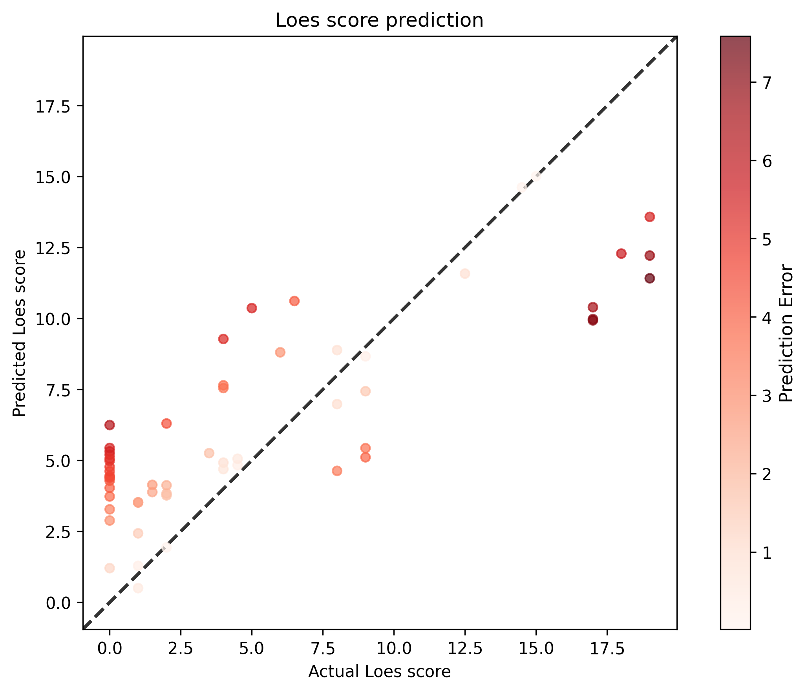

# Regression

This document explains [src/dcan/regression/training.py](/src/dcan/regression/training.py).

This is a comprehensive deep learning pipeline for training a neural network to predict Loes scores from MRI scans. Loes scores are medical assessments used to evaluate brain abnormalities, particularly in conditions like X-linked adrenoleukodystrophy (X-ALD).

## What it does:
The code trains a ResNet model to automatically predict Loes scores from MRI images, essentially automating a medical scoring process that would normally require expert radiologists.

## How to run it:

### First simple run

1. `ssh -Y agate`
2. Change directory to the *scripts/training/regression* folder.  For example:
    
        cd /users/9/reine097/projects/loes-scoring-2/scripts/training/regression/

3. You will be running the [loes-scoring-training_model_agate_27.sh](../scripts/training/regression/loes-scoring-training_model_agate_27.sh) file.  This generates the best model found so far.

        sbatch loes-scoring-training_model_agate_27.sh 

4. You should get results similar to this:

* standardized_rmse: 0.6359392229708403
* correlation_coefficient: 0.8350017989179795
* Pearson correlation p-value: 6.847451972747865e-16
* Spearman correlation p-value: 2.416301571229704e-10



### Inputs:

* Spreadsheet (CSV file).  Must contain the following columns:
  
  * anonymized_subject_id
  * anonymized_session_id
  * scan
  * loes-score
  * Gd-enhanced
  * training
  * validation

### Outputs:
* Model (.pt) file
* Statistics (written to the log file)
* Plot of actual versus predicted Loes scores for scans in the validation set.

## How it works:
### 1. Architecture & Organization
The code is structured using several key classes:

* `Config`: Handles command-line arguments and configuration
* `ModelHandler`: Manages the neural network model (ResNet)
* `TrainingLoop`: Handles the training and validation process
* `TensorBoardLogger`: Logs metrics for visualization
* `LoesScoringTrainingApp`: Main application orchestrator

### 2. Data Pipeline

* Reads a CSV file containing MRI file paths and corresponding Loes scores
* Uses `LoesScoreDataset` to load and preprocess MRI images
* Splits data into training and validation sets based on subject IDs
* Supports both manual train/validation splits and predefined columns

### 3. Model Training Process
**Loss Function**: Uses Mean Squared Error (MSE) since this is a regression problem (predicting continuous Loes scores). It includes an **optional weighted loss** feature that gives more importance to rare Loes score values in the training data.

**Training Loop:**
```python
    for epoch in range(1, self.config.epochs + 1):
        # Training phase
        trn_metrics = loop_handler.train_epoch(epoch, self.train_dl)
        # Validation phase  
        val_metrics = loop_handler.validate_epoch(epoch, val_dl)
        # Log metrics and adjust learning rate
```
### 4. Key Features
**Weighted Loss Calculation**: The system counts how frequently each Loes score appears in training data and weights the loss inversely - rare scores get higher weights to prevent the model from ignoring uncommon cases.

**Learning Rate Scheduling:** Supports multiple schedulers:

* `educeLROnPlateau`: Reduces learning rate when validation loss plateaus
* `StepLR`: Reduces learning rate at fixed intervals
* `CosineAnnealingLR`: Uses cosine annealing
* `OneCycleLR`: One-cycle learning rate policy

**Multi-GPU Support**: Automatically uses multiple GPUs if available via DataParallel.

### 5. Evaluation & Output
After training, the system:

* Makes predictions on validation data
* Calculates standardized RMSE (Root Mean Square Error)
* Computes correlation coefficients (Pearson and Spearman)
* Creates scatter plots comparing actual vs predicted scores
* Saves results to CSV files

### 6. Medical Context
The pipeline is specifically designed for medical imaging analysis where:

* **Input**: MRI brain scans
* **Output**: Loes scores (numerical assessment of brain abnormalities)
* **Goal**: Automate expert radiological assessment

This type of system could significantly speed up medical diagnosis and provide consistent scoring across different medical centers, though it would require extensive validation before clinical use.
